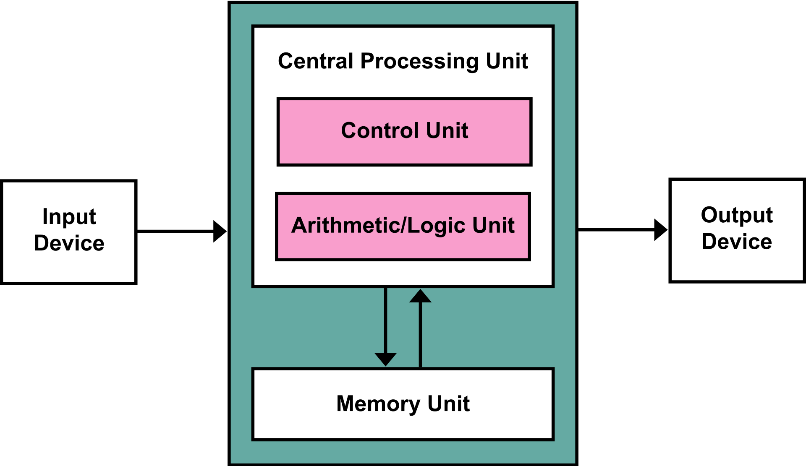

# Introduction to Computers and Programming

## What is a Computer?

Electronic device that proccess data by following a set of instructions (= program). It can perform calculations, store and retrieve information and controlls devices.

## Von Neumann Architecture

Proposed by [John von Neumann](https://en.wikipedia.org/wiki/John_von_Neumann) in 1945.



### Input devices

Serve to enter data and instructions. Analogy: like your senses - they gather information for the computer from the outside worlds. Examples:

*   Keyboard
*   Mouse
*   Microphone
*   Scanner
*   Touch display

### Output devices

Present results of computer’s processing to the user. Examples:

*   Monitor
*   Printers
*   Speakers

Analogy: your actions. You communicate with (towards) the world by them.

## How does a CPU work?

* Control Unit (CU): The Brain of the computer. Control Unit directs flow between memory, CPU, I/O devices
* Arithmetic Logic Unit (ALU): performs arithmetic (+, -, …) and logical operations (AND, OR).

Logical operations are also called boolean operations after [George Boole](https://en.wikipedia.org/wiki/George_Boole). `True` is often represented as 1 and `False` as 0.

### Logical AND

| Input A | Input B | A ∧ B |
| --- | --- | --- |
| 0   | 0   | 0   |
| 0   | 1   | 0   |
| 1   | 0   | 0   |
| 1   | 1   | 1   |

### Logical OR

| Input A | Input B | A ∨ B |
| --- | --- | --- |
| 0   | 0   | 0   |
| 0   | 1   | 1   |
| 1   | 0   | 1   |
| 1   | 1   | 1   |

## Memory and Storage

### Registers

*   Registers are small, high-speed storage locations within the CPU itself.
*   Extremely fast (much faster than memory or storage).
*   Very limited in size (typically 8, 16, 32, or 64 bits wide, depending on the CPU architecture).
*   Registers fetch instructions from memory, store intermediate computation results, and provide operands for the CPU.

### RAM

*   Memory is the part of the system used for temporarily storing data and instructions that the CPU needs during program execution.
*   It acts as the workspace for active processes and provides data to the CPU.
*   Stores instructions fetched from storage so that they can be quickly accessed.
*   Slower than registers but faster than storage.
*   Larger in size compared to registers (e.g., modern systems have several GBs of RAM).
*   Volatile: contents are lost when power is turned off.
*   The CPU reads instructions and data from memory into registers. Once a task is complete, results may be written back to memory.

### Storage

*   Storage refers to non-volatile devices, such as hard drives (HDDs), solid-state drives (SSDs), or even cloud storage (e.g. AWS S3).
*   Long-term retention of data and programs, even when the computer is turned off.
*   Much slower than both memory and registers.
*   Much larger capacity compared to memory and registers (e.g., modern systems often have TBs of storage).

## Operating Systems

An Operating System (OS) is software that manages a computer’s hardware and software resources, acting as an intermediary between users and the computer hardware. It ensures efficient execution of programs, resource allocation, and system stability.

### Functions

*   Process Management
*   Memory Management
*   File System Management
*   Device Management
*   User Interface

### Types

*   Windows
*   UNIX
    *   Linux
        *   Android
    *   macOS
        *   iOS

## Programming Languages

Programming languages are the medium for humans to write programs that a computer can execute. They are needed to:

*   Bridge the gap: Computers understand only binary (0 and 1). Computer languages allow for writing instructions in a human readable form.
*   Simplification : allow to break down problems into
*   Resuse: programs can be reused and automate repetitive tasks.

### Types

#### Low-Level Languages

*  **Machine Language**: Example: `10110000 01100001`
*  **Assembly langauage**: symbolic representation of machine language using mnemonics. Example:

```
MOV A, 5
ADD B, A
```

#### High-Level Languages

Designed to be easier to read and write, closer to human languages. Requires a compiler or interpreter (or both) to translate into machine code. Examples:

*   **C**: very low-level and thus performant. Compiled. Non-portable.
*   **Java**: First compiled. Then resulting code is interpreted in the Java Virtual Machine. Cross-platform. Popular for enterprise apps.
*   **JavaScript**: Very high level. Leans closer to C-style syntax. Used in browsers to create Frontends.
*   **Python**: Very high level, easy to read, beginner friendly. Cross-platform. Popular for data-science (AI), prototyping and scripting.

High level scripting languages are used for automating tasks. Examples:

*  **Python**
*  **Bash**

### Compiled vs. Interpreted

*   Computer only understands machine code
*   Some languages compile their files into machine code (e.g. C)
*   Some take the source code and interpret it (e.g. Python)
*   Some use both approaches (e.g. Java)

Usually low-level (performant) languages are compiled and high-level (closer to human thinking) are interprete.

### Common Characteristics

*   Syntax: rules, how code must be written.
*   Semantics: Meaning of a statement or instruction. Example:

```
print("Hello")
2+2
```

*   Control Structures: loops and condititionals that control the flow of exeuction. Example `if`, `while`.

### Categories of High-Level Languages

*  **Procedural**: focus on a sequence of steps to solve a problem. Example: C.
*  **Object-Oriented**: model entities of outside worlds as objects encapsulating data and behavior. Example: Java, C++.
*  **Functional**: focus on mathematical functions. Example: Haskell.
*  **Logical**: express facts and rules for reasoning. Example: Prolog.

Some programming languages fit into several categories, e.g. Python and Javascript support both procedural, object-oriented and functional programming.

## Homework (graded)

*   Install `htop`. Don’t know how? Use Google/ChatGPT.
*   Make a screenshot.
*   Identify any process and explain what its values mean.